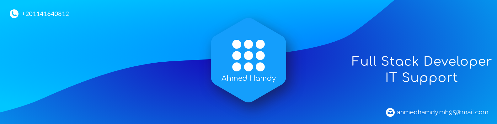

 

---

## About Me

**Full Stack Engineer** — Laravel · Node.js · TypeScript · AI Integrations

- 🔭 Working at **Al Kayan Construction & Engineering** as Full Stack Developer
- 🤖 Building AI-powered APIs with OpenAI, Fastify, and TypeScript
- ⚙️ Specializing in **Laravel REST APIs**, **Node.js**, **Bun**, and **Docker**
- 🌱 Currently leveling up: system design, distributed systems, staff engineering track
- 💬 Ask me anything — I genuinely enjoy it
- 📍 Cairo, Egypt

---

## Featured Projects

| Project | Stack | Description |
| --- | --- | --- |
| [**ts-ai-api**](https://github.com/Ahmed-Hamdy101/ts-ai-api) | TypeScript · Fastify · OpenAI · Vitest | Production-ready AI REST API — chat, summarize, full test suite, Docker |
| [**laravel-admin-api**](https://github.com/Ahmed-Hamdy101/admin-api-laravel) | Laravel · Passport · MySQL · Docker | Admin backend — RBAC, JWT auth, product/order management, CSV export |

---

## Skills

|  |  |  |
| :---: | :---: | :---: |

**Languages & Frameworks**

**Tools & Infra**

---

## GitHub Stats

---

## Community

### Team

| Developer | Role | Profile |
| --- | --- | --- |
| Mina | Node.js & Python Backend |   |

### Chat

