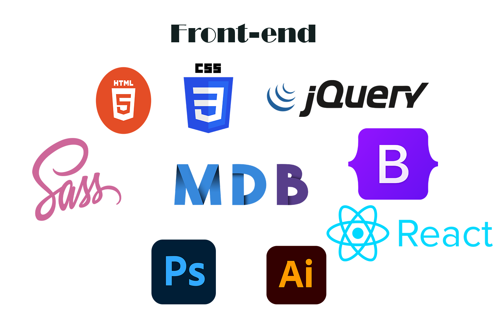
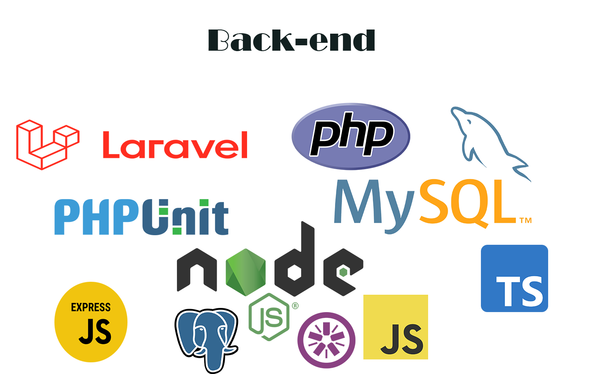
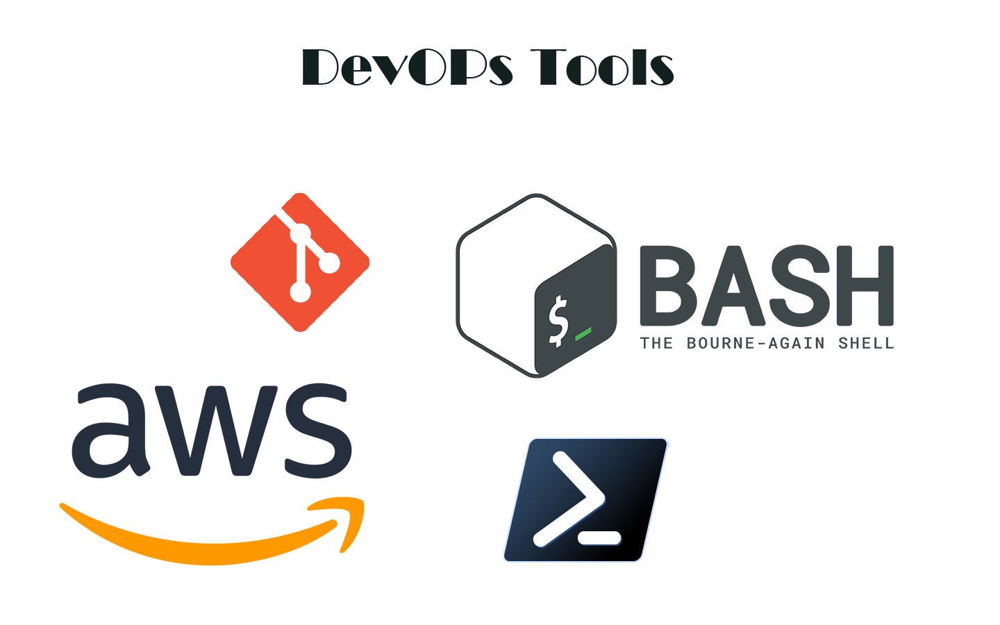

  
<h1>
Ohayoo  
  
</h1>
 
  

       <h2 align="center"> Hi there, I'm Ahmed Hamdy </h2> 
    <h5 align="center"> You can call me mando/Tron/Turrai </h5>
  
   
  <a href="https://twitter.com/Torn40535516"> 

  ## Good to see you  
  
  I am Full Stack Web Developers, I Love Coding, Writing, Learning New Things, Speaking New Languages
  
  As Full Stack I like make Diference Things, I love to makes an new idea to make this world is better place
  
- 🔭 I’m currently working on PHP Coffe dev /web dev and IOS app + Desktop app
- 🌱 I’m currently Training On IT Support Specialist With Google,I want to become S.R React Developer,also Software Enginee, Depth work in Cyber-Security, I like to manage my time, Deep-Deiv without stop    
- 👯 I’m looking to collaborate with Some Cool Developer
- 💬 you can Ask me anything, I like Peoples to ask me 
- 📫 How to reach me: you can text me or contact me at Facebook... 
<!--
**Turria101/Turria101** is a ✨ _special_ ✨ repository because its `README.md` (this file) appears on your GitHub profile.

Here are some ideas to get you started:

- 🔭 I’m currently working on ...
- 🌱 I’m currently learning ...
- 👯 I’m looking to collaborate on ...
- 🤔 I’m looking for help with ...
- 💬 Ask me about ...
- 📫 How to reach me: ...
- 😄 Pronouns: ...
- ⚡ Fun fact: ...
-->
## My Skills 

| |  | |
|               ---                   |                   ---                |        ---                          |
# My Stats :

