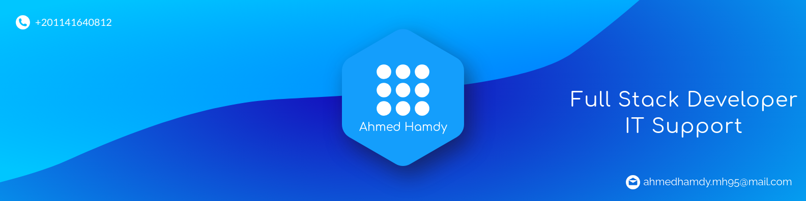
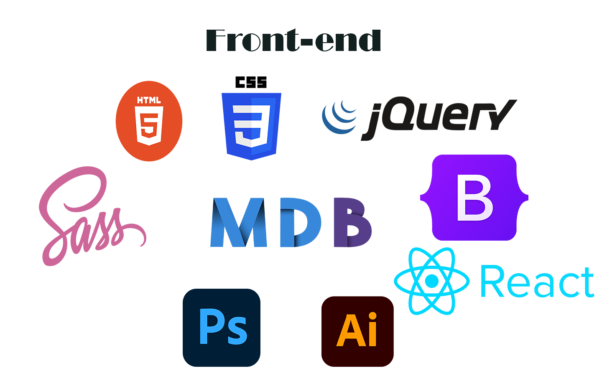
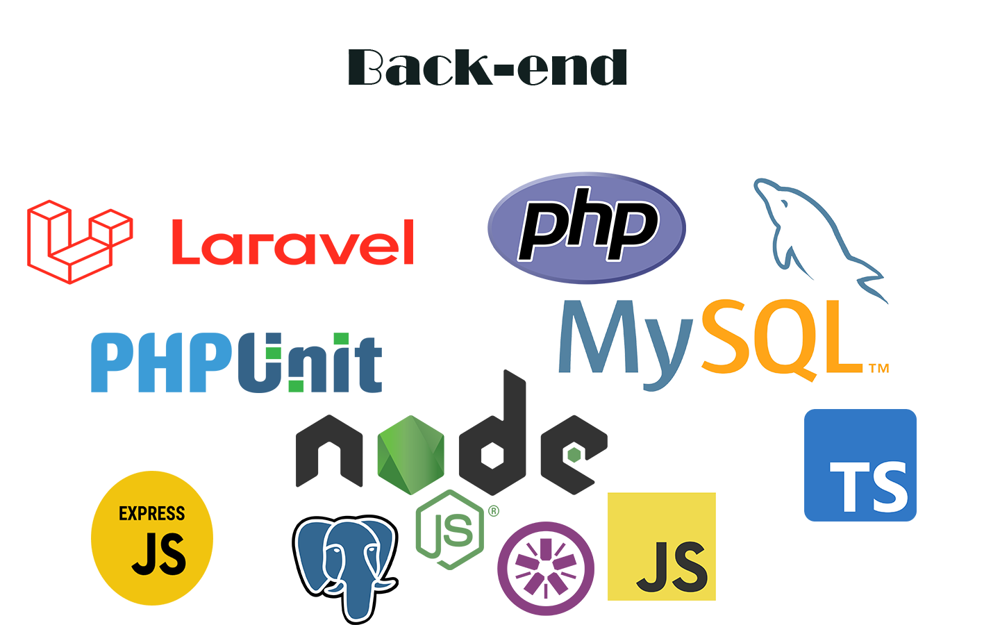
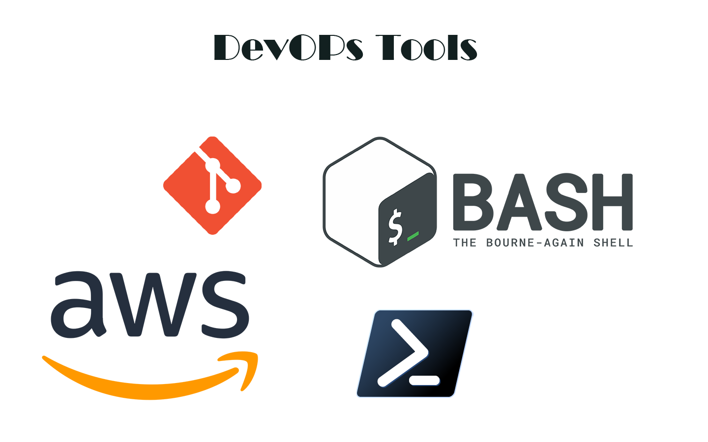

 

 

---

## About Me

**Full Stack Engineer** focused on Laravel, Node.js, TypeScript, and AI integrations.

- 🔭 Working at **Al Kayan Construction & Engineering** as a Full Stack Developer
- 🤖 Building AI-powered APIs with OpenAI, Fastify, and TypeScript
- ⚙️ Specializing in **Laravel REST APIs**, **Node.js**, **Bun**, and **Docker**
- 🌱 Currently improving my skills in system design and distributed systems
- 💬 Ask me anything about web development, APIs, or backend architecture
- 📍 Cairo, Egypt

---

## Featured Projects

| Project | Stack | Description |
| --- | --- | --- |
| [**ts-ai-api**](https://github.com/Ahmed-Hamdy101/ts-ai-api) | TypeScript · Fastify · OpenAI · Vitest | Production-ready AI REST API with chat, summarization, testing, and Docker |
| [**laravel-admin-api**](https://github.com/Ahmed-Hamdy101/admin-api-laravel) | Laravel · Passport · MySQL · Docker | Admin backend with RBAC, JWT authentication, product management, order management, and CSV export |

---

## Skills

| Frontend | Backend | DevOps |
| :---: | :---: | :---: |
|  |  |  |

### Languages & Frameworks

### Tools & Infrastructure

---

## GitHub Activity

---

## Community

### Team

| Developer | Role | Profile |
| --- | --- | --- |
| Mina | Node.js & Python Backend Developer |   |

### Chat

---

### Let's build something useful.

