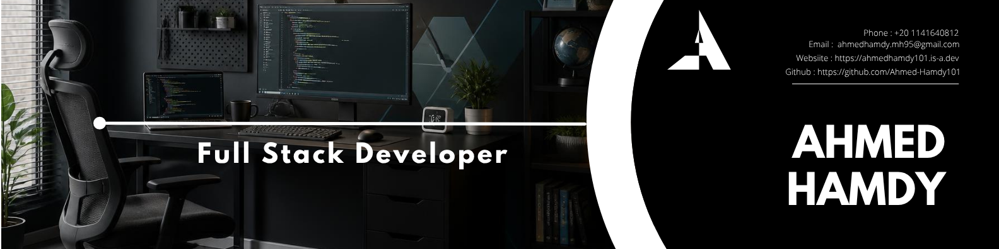

 

 

---

## About Me

**Full Stack Engineer** focused on Laravel, Node.js, TypeScript, and AI integrations.

- 🔭 Working at **Al Kayan Construction & Engineering** as a Full Stack Developer
- 🤖 Building AI-powered APIs with OpenAI, Fastify, and TypeScript
- ⚙️ Specializing in **Laravel REST APIs**, **Node.js**, **Bun**, and **Docker**
- 🌱 Currently improving my skills in system design and distributed systems
- 💬 Ask me anything about web development, APIs, or backend architecture
- 📍 Cairo, Egypt

---

## focus on 🎯

- Scalable full stack applications
- Type-safe APIs and backend architecture
- AI-powered features and RAG pipelines
- Performance, security, and maintainable code
- SaaS platforms and business automation

Currently open to remote Full Stack, Backend, and AI Integration opportunities.

## What I Care About

- Clear architecture over unnecessary complexity
- Fast interfaces with measurable performance
- Secure APIs with strong validation
- Documentation that helps people ship
- Open-source projects that solve real problems

##  Projects

| Project | Stack | Description | Status |
| --- | --- | --- | --- |
| [ET GCO Tours](https://www.egypt-tour-guide.com/) | Bilingual tourism platform with booking and real-time inventory | Next.js, Express, TypeScript, PostgreSQL, Redis | [View Demo](https://github.com/Ahmed-Hamdy101/et-gco-tours-showcase) |
| [Al Kayan Construction(Legacy)](https://www.alkayan-co.com) | Company platform and admin CMS with role-based access | PHP, MySQL, JWT, Docker |
| [Al Kayan Nova](https://ahmedhamdy101.is-a.dev/projects/alkayan-nova) | Interactive construction platform with 3D experiences | OOP , Shared Layer UI , SEO Optimazation ,fixed broken cache-busting, Security Improvment , PHPUnit suite , PHP MVC, Three.js, GSAP | [View Demo](https://github.com/Ahmed-Hamdy101/alkayan-nova-ux-clean) |
| [Al Kayan ERP SYSTEM](#) | ERP Stock – Data model, APIs, business logic , ERP Stock – Admin UI, dashboard, reports | ___ |
| [Logger Suite SAAS ](#) | Multi-tenant SaaS ERP combining Next.js 15 frontend with Laravel REST backend. Admin/Editor/Guest RBAC, Redis caching, AWS EC2/S3. | Laravel, NextJS, KafKa, GSAP ,TailwindCSS | [View Demo](https://ahmedhamdy101.is-a.dev/projects/logger-suite-erp)|
| [ts-ai-api](https://github.com/Ahmed-Hamdy101/ts-ai-api) | Fastify API with OpenAI integration | TypeScript, Fastify, OpenAI, Docker | [View Demo](https://github.com/Ahmed-Hamdy101/ts-ai-api) |
| [Laravel REST API](https://github.com/Ahmed-Hamdy101/laravel-rest-api) | Admin API with OAuth2, RBAC, and Swagger documentation | Laravel, Passport, JWT | [View Project](https://github.com/Ahmed-Hamdy101/laravel-rest-api) |
| [Node.js Storefront API](https://github.com/Ahmed-Hamdy101/node-js-store-front-api) | Tested e-commerce REST API | Node.js, Express, PostgreSQL, Jasmine | [ View Project ](https://github.com/Ahmed-Hamdy101/nodejs-store-front-api) |
| [Auto Sercice Demo](https://github.com/Ahmed-Hamdy101/node-js-store-front-api) | Business software for managing vehicle repair requests, technicians, spare parts, orders, and payments in one workspace — role-based dashboards for customers, technicians, and admins. |Bun, Next.js 16, React 19, TypeScript 5 Prisma 6, SQLite ,Tailwind CSS 4, shadcn/ui, Radix UI,React Hook Form, Zod TanStack Query, Zustand, date-fns Sharp, Framer Motion, DND Kit,Caddy | [View Project](https://github.com/Ahmed-Hamdy101/autofix-service-platform-demo)
| [GIS DASHBOARD MAP ](https://github.com/Ahmed-Hamdy101/node-js-store-front-api) | Multilingual (EN/AR/FR) GIS dashboard for exploring buildings across the Sinai region on an interactive Cesium 3D terrain map, with point-to-point distance & travel-time calculation. |Nodejs/Typescript Next.js ,Express , Prisma ,PostgreSQL , CesiumJS , JWT| [View Project](https://github.com/Ahmed-Hamdy101/autofix-service-platform-demo)
---

## Planning Projects

| Project | Status |
| --- | --- |
| [AI 3D Warrior Model Generator](#) | 🔴| 
| [AI Youtube Video Generator](#) | 🔴|
| [Jaxi - AI Agent ](#) | 🔴| 
| [Money Wise](#) | 🔴| 

---

## Skills

### Languages & Frameworks

### Core Concepts

### Cloud

### AI

### Engineering

---

## GitHub Activity

---

## Community

### Team

| Developer | Role | Profile |
| --- | --- | --- |
| Mina | Node.js & Python Backend Developer |   |

### Chat

---

### Let's build something useful.

