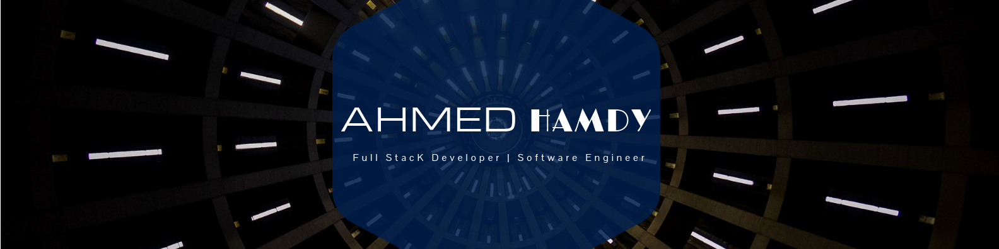
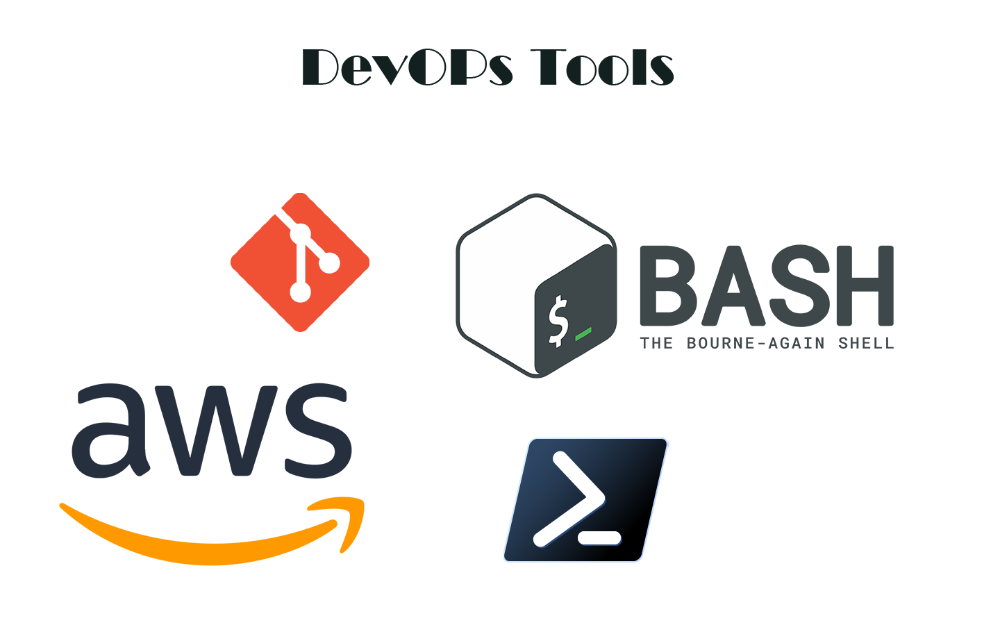

  

  <h2> About Me </h2>
  
  I am Full Stack Web Developers, I Love Coding, Writing, Learning New Things, Speaking New Languages
  
- 🔭 I’m currently working at **Al Kayan construction and engineer consultation** as **full-stack** -**Developer**, and also have stright goal to become **IOS Developer +x desktop**

- 🌱 I’m currently Training On Some coursed in the IT field, I want to become S.R React Developer, also Software Engineer, Depth work in Cyber-Security, I like to manage my time, Deep-Deiv without stop  
  
- 👯 I’m looking to collaborate with Some Cool Developer
- 💬 you can Ask me anything, I like People to ask me 
- 📫 How to reach me: you can text me or contact me on Facebook... 
<!--
**Turria101/Turria101** is a ✨ _special_ ✨ repository because its `README.md` (this file) appears on your GitHub profile.

Here are some ideas to get you started:

- 🔭 I’m currently working on ...
- 🌱 I’m currently learning ...
- 👯 I’m looking to collaborate on ...
- 🤔 I’m looking for help with ...
- 💬 Ask me about ...
- 📫 How to reach me: ...
- 😄 Pronouns: ...
- ⚡ Fun fact: ...
-->
## My Skills 

| |  | |
|               ---                   |                   ---                |        ---                          |
# My Stats :

<h1> My Team </h1>

| Name|      Role        | Profile
| ---  |        ---      | ---------|
|Mina| NodeJs Back End Developer | 
|Ahmed Hamdy|Full Stack Developer | |

## Contact Us 

  

